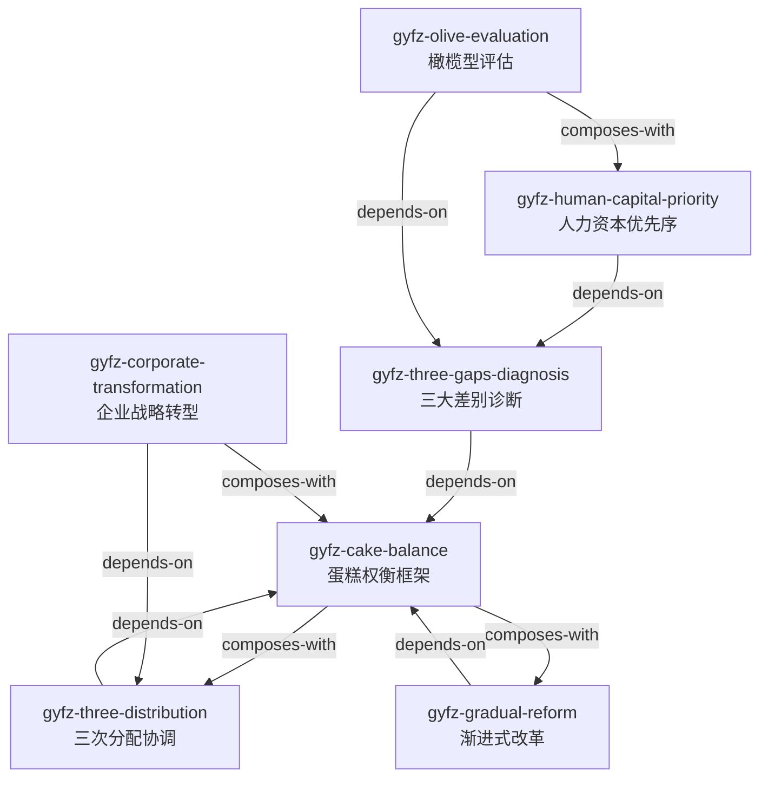

# 共同富裕 — Skill 总览与引用图 (阶段 3 产出)

## Skill 列表

| # | Skill | 核心问题 | 章节 |
|---|---|---|---|
| 1 | `gyfz-cake-balance` | 发展与分配如何动态平衡？ | 总论+第一篇 |
| 2 | `gyfz-three-gaps-diagnosis` | 不平等的三大根源在哪？ | 总论+第一篇 |
| 3 | `gyfz-three-distribution` | 三层分配机制如何协调？ | 第三篇 |
| 4 | `gyfz-gradual-reform` | 改革节奏如何设计？ | 总论+第一篇 |
| 5 | `gyfz-human-capital-priority` | 人力资本投资优先序？ | 第三篇 |
| 6 | `gyfz-corporate-transformation` | 企业如何参与共富？ | 第四篇 |
| 7 | `gyfz-olive-evaluation` | 分配结构是否健康？ | 第三篇 |

## 引用关系图

## 引用关系说明

- **CB → TD/GR**: 蛋糕平衡是顶层框架，决定"要不要分配"和"怎么推进"
- **TGD → CB**: 诊断差距后，需用蛋糕平衡框架决定对策
- **HCP → TGD**: 诊断差距根源后，用人力资本投资解决
- **CT → TD**: 企业转型需理解三次分配机制
- **OE → TGD/HCP**: 评估结构需先诊断差距+人力资本投资

## 使用建议

- **政策设计**: CB → TGD → TD → GR
- **企业战略**: CB → CT → TD
- **教育/扶贫**: TGD → HCP → OE
- **评估诊断**: TGD → OE
