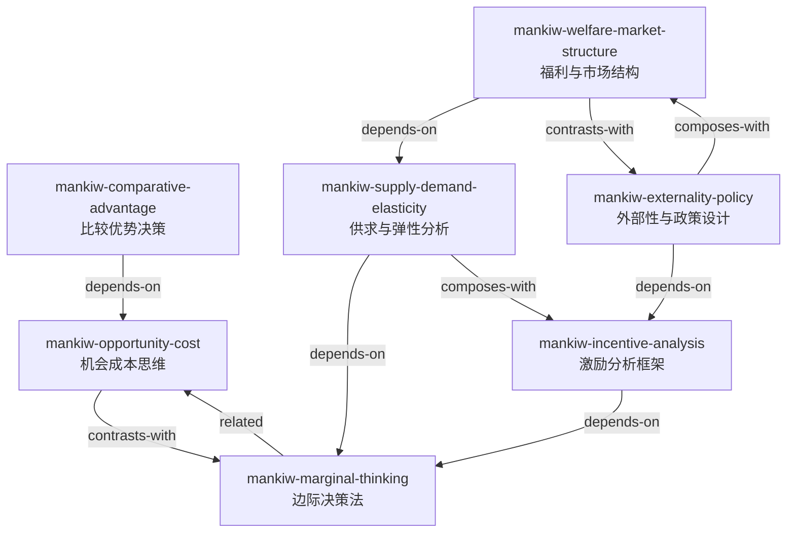

# 曼昆经济学 — Skill 总览与引用图 (阶段 3 产出)

## Skill 列表

| # | Skill | 核心问题 | 章节 |
|---|---|---|---|
| 1 | `mankiw-opportunity-cost` | 选A的真实成本是放弃什么？ | 第1章 |
| 2 | `mankiw-marginal-thinking` | 多一单位值不值？ | 第1+14章 |
| 3 | `mankiw-incentive-analysis` | 政策变化后人们会怎么反应？ | 第1+6章 |
| 4 | `mankiw-comparative-advantage` | 谁该做什么？ | 第3章 |
| 5 | `mankiw-supply-demand-elasticity` | 价格变化对市场影响多大？ | 第4-6章 |
| 6 | `mankiw-welfare-market-structure` | 这个市场有效率吗？ | 第7+14-17章 |
| 7 | `mankiw-externality-policy` | 行为影响了第三方怎么办？ | 第10-11章 |

## 引用关系图

## 引用关系说明

- **OC → CA**: 比较优势建立在机会成本计算之上（"谁放弃的代价更小"）
- **MT → IA**: 激励通过改变边际成本/收益起作用
- **MT → SDE**: 供求曲线的交点本质是边际收益=边际成本
- **SDE → WMS**: 福利分析建立在供求模型之上
- **IA → EP**: 外部性本质是激励错位（私人激励≠社会激励）
- **WMS ↔ EP**: 福利分析假设无外部性，外部性分析处理市场失灵——互补关系
- **OC ↔ MT**: 机会成本问"选什么"，边际思维问"选多少"——互补但不同维度

## 使用建议

- **个人决策**: OC → MT → CA
- **政策分析**: IA → SDE → WMS → EP
- **商业策略**: SDE → WMS → CA
- **公共议题**: EP → WMS → IA
