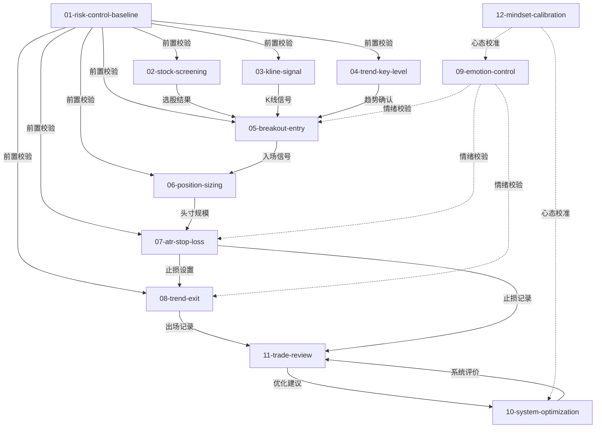

# 股票交易全套 Skill 体系 — Skill Index

> 本体系由 book2skill v2.0 多书协同蒸馏，基于 7 本交易/投资经典跨书整合，共产出 **12** 个 skills。
> 处理时间: 2026-06-19

## 关于本体系

- **类型**: 多书协同（跨 7 本经典）
- **核心流派**: 趋势交易（执行层）+ 价值投资（辅助层）+ 东方哲学（心态层）
- **一句话主旨**: 截短亏损，让利润奔跑——用量化系统替代主观判断，用纪律执行克服人性弱点
- **整书理解**: 见 [BOOK_OVERVIEW.md](./BOOK_OVERVIEW.md)
- **系统架构**: 见 [SYSTEM_OVERVIEW.md](./SYSTEM_OVERVIEW.md)

---

## Skill 列表 (按层级分组)

### 风控基础层（前置+后置校验）

- [`01-risk-control-baseline`](./01-risk-control-baseline/SKILL.md) — 风控基线校验：单笔风险≤1%、回撤保护15%/20%、板块集中≤20%
- **入口skill**: 所有交易操作必须先跑01

### 分析层

- [`02-stock-screening`](./02-stock-screening/SKILL.md) — 选股过滤：大盘60日线+行业格局+CANSLIM+估值区间
- [`03-kline-signal`](./03-kline-signal/SKILL.md) — K线信号：形态识别+ATR位置确认+成交量分级
- [`04-trend-key-level`](./04-trend-key-level/SKILL.md) — 趋势关键位：道氏趋势+三级强度+周期定位+价值锚

### 执行层

- [`05-breakout-entry`](./05-breakout-entry/SKILL.md) — 突破入场：10/20日突破+涨停过滤+T+1处理+利弗莫尔关键点
- [`06-position-sizing`](./06-position-sizing/SKILL.md) — 头寸规模：修正公式 股数=资金×1%/(2×ATR)+持仓限制
- [`07-atr-stop-loss`](./07-atr-stop-loss/SKILL.md) — ATR止损：2×ATR止损+加仓止损max修正+跌停处理
- [`08-trend-exit`](./08-trend-exit/SKILL.md) — 趋势出场：10日低点+浮盈回撤10%/15%+交易成本计算

### 心理层

- [`09-emotion-control`](./09-emotion-control/SKILL.md) — 情绪控制：3问快速评估+芒格25偏误检测+红黄绿分级
- [`10-system-optimization`](./10-system-optimization/SKILL.md) — 系统优化：R乘数+期望值+交易成本计入+多元思维

### 复盘层

- [`11-trade-review`](./11-trade-review/SKILL.md) — 交易复盘：五维度分析+利弗莫尔归因+模式识别

### 辅助层（严格限界）

- [`12-mindset-calibration`](./12-mindset-calibration/SKILL.md) — 心态校准：易经时位+周易决策哲学（仅心态，不进决策链）

---

## 引用图



图例:
- `-->`  depends-on（依赖/前置）
- `-.->` contrasts-with（辅助/校验，不进入决策链）
- `===>` composes-with（跨书组合）

---

## 推荐使用顺序

1. **01-risk-control-baseline** — 最基础，所有交易操作的前置校验
2. **02-stock-screening** — 选股过滤，依赖01通过
3. **04-trend-key-level** — 趋势判断，依赖01通过
4. **03-kline-signal** — K线信号确认，依赖01通过
5. **05-breakout-entry** — 入场执行，依赖01+02+03+04
6. **06-position-sizing** — 头寸计算，依赖05入场信号
7. **07-atr-stop-loss** — 止损设置，依赖06头寸
8. **08-trend-exit** — 出场规则，依赖07止损
9. **09-emotion-control** — 情绪校验（可随时调用）
10. **10-system-optimization** — 系统评价（需10+笔交易记录）
11. **11-trade-review** — 交易复盘（每笔交易后调用）
12. **12-mindset-calibration** — 心态校准（仅心态，严格限界）

---

## 关键修复清单

| 修复项 | 旧版问题 | 新版修复 | 体现skill |
|---|---|---|---|
| 头寸公式 | 公式数学错误 | 股数=资金×1%/(2×ATR) | 06 |
| 加仓止损 | 止损下移 | max(原止损, 新入场价-2×ATR) | 07 |
| A股涨停 | 未处理 | 涨停不追单+次日开盘 | 05 |
| 市场过滤 | 只用20日线 | 增加60日线+板块强度 | 02 |
| 回撤保护 | 无账户级熔断 | 15%减仓/20%清仓 | 01 |
| 板块集中 | 无限制 | 单一行业≤20% | 01 |
| 交易成本 | 未计入 | 佣金+印花税+滑点 | 08,10 |
| 入场参数 | 20/55日太迟 | 10/20日突破 | 05 |
| 出场规则 | 只用20日线 | 10日低点+浮盈回撤10%/15% | 08 |
| test-prompts | 4处P0错误 | 全部修正 | 全部 |

---

## 接入 darwin-skill

所有 skill 均带有 `test-prompts.json` (darwin-skill 兼容格式), 可直接接入自动进化:

```
darwin evolve library/stock-trading-system/
```

---

## 审计轨迹

- BOOK_OVERVIEW: [BOOK_OVERVIEW.md](./BOOK_OVERVIEW.md)
- SYSTEM_OVERVIEW: [SYSTEM_OVERVIEW.md](./SYSTEM_OVERVIEW.md)
- 全局索引: [../GLOBAL_INDEX.md](../GLOBAL_INDEX.md)
- 冲突矩阵: [../CONFLICTS.md](../CONFLICTS.md)
- 统一术语: [../GLOSSARY_UNIFIED.md](../GLOSSARY_UNIFIED.md)
