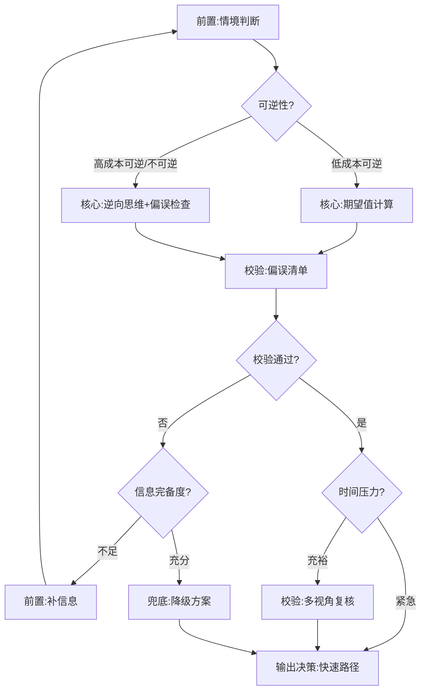

# 阶段 6 — 决策卡片构造（Decision Cards）

## 目标

对高频决策场景（如"该不该止损""该不该跳槽""该不该接这个项目"），把多本书的 skills 编排成一张**可复用的决策卡片**，让用户遇到这类场景时直接调用。

决策卡片是阶段 5（多书协同编排）的**固化产物**——把高频意图的编排逻辑沉淀下来，不用每次重新跑召回+消解。

## 何时构造决策卡片

**触发条件**（满足任一）：
1. 同一类意图被用户提出 ≥3 次（高频）
2. 意图涉及 ≥2 本书的冲突观点（高价值）
3. 意图涉及不可逆决策（高代价，如辞职、大额投资）

**不构造决策卡片的场景**：
- 一次性问题（如"帮我查一下这本书的作者"）
- 纯信息查询
- 日常琐碎选择

## 决策卡片结构

使用 `templates/DECISION_CARD.md.template`，包含以下字段：

### 1. 基本信息

```yaml
---
card_id: stop-loss
scenario: 持仓亏损，该不该止损
intent_type: decision
books_involved: [炒股的智慧, 穷查理宝典, 巴菲特致股东信]
conflict_level: C  # A/B/C
last_updated: 2026-06-19
---
```

### 2. 决策情境分类

按五个维度分类，决定编排策略：

| 维度 | 取值 | 影响 |
|---|---|---|
| **可逆性** | 不可逆 / 高成本可逆 / 低成本可逆 | 不可逆和高成本可逆都需要更多校验 skill |
| **影响范围** | 仅自己 / 涉及他人 / 组织级 | 范围越大需要更多视角 |
| **时间压力** | 紧急 / 充裕 | 紧急时走快速路径 |
| **信息完备度** | 充分 / 不足 | 不足时触发"先补信息"前置 skill |
| **利益相关方** | 仅自己 / 涉及他人 / 需他人执行 | 涉及他人时需要协商/沟通 skill 作为前置 |

**维度优先级**：可逆性 > 利益相关方 > 信息完备度 > 时间压力

**组合规则**：不可逆 + 信息不足 → 强制走"先补信息"前置 skill，即使时间压力紧急

### 3. 参与的 skill 列表

每个参与的 atomic skill 标注角色：

| 角色 | 含义 | 数量 |
|---|---|---|
| **前置** | 决策前必须先跑的 skill（如"信息收集""情境判断"） | 0-2 |
| **核心** | 决策的主要方法论 | 1-2 |
| **校验** | 对核心结论做 sanity check 的 skill | 1-2 |
| **兜底** | 核心结论不可靠时的降级方案 | 0-1 |

### 4. 编排流程（DAG）

用 mermaid 画出 skill 之间的执行顺序和数据流。DAG 覆盖所有维度分支，且**支持回环**——校验失败时可回到前置 skill 重新执行：



**回环说明**：校验失败且信息不足时，回到前置 skill 重新执行（最多 1 轮回环），仍失败则走兜底。

### 5. 冲突仲裁规则

当参与的核心 skill 给出矛盾建议时，按结构化规则裁决（字段名与 intent-classifier 输出一致，skill_id 用 `<book-slug>::<skill-slug>` 格式）：

```yaml
arbitration_rules:
  - condition:
      field: time_horizon
      operator: in
      value: [短期, 紧急]
    prefer: "炒股的智慧::stop-loss-discipline"
    reason: "短线场景止损纪律优先"
  - condition:
      field: time_horizon
      operator: in
      value: [长期]
      and:
        field: target_type
        operator: equals
        value: 增长
    prefer: "巴菲特致股东信::no-stop-loss"
    reason: "长线价值投资不止损"
  - condition:
      field: time_horizon
      operator: equals
      value: 未知
    action: "触发 horizon 诊断子流程"
    diagnostic_questions:
      - "你目前的主要收入来源是否依赖这次投资？(是→短期)"
      - "你是否有 3 年以上的应急储备？(是→可长期)"
    after_diagnosis: "根据诊断结果重新走仲裁规则"
    fallback: "诊断后仍无法判断 → 呈现两派观点 + 决策清单"
```

### 6. 适用边界

每张决策卡片必须标注适用边界，超出边界时回退到阶段 5 动态编排：

```yaml
applicable_boundary:
  applies_to: "单只股票亏损 10%-50% 的止损决策"
  not_applicable_to: ["组合级止损", "衍生品止损", "做空止损"]
  out_of_boundary_action: "回退到阶段 5 动态编排"
```

### 7. 补全提问阈值

补全提问不是固定"≥2 个未知就提问"，而是按决策情境动态调整：

| 决策情境 | 提问阈值 | 说明 |
|---|---|---|
| 不可逆 + 高影响 | ≥1 个关键信号未知 | 关键信号：reversibility, time_horizon（不可缺） |
| 高成本可逆 + 中影响 | ≥2 个未知 | |
| 低成本可逆 + 低影响 | ≥3 个未知，或直接走快速路径 | |

### 8. 决策日志模板

用户用决策卡片做决策后，系统自动填充前半段，复盘按决策类型定时触发：

```markdown
## 决策日志

- **日期**: 2026-06-19
- **情境**: 持仓腾讯亏损 15%
- **使用的 skill**: 炒股的智慧::stop-loss-discipline + 穷查理宝典::inversion-thinking
- **决策**: 减仓 30%
- **理由**: 短线场景，止损纪律优先
- **实际结果**: （系统按复盘触发条件提醒回填）
- **复盘**: （系统按复盘触发条件提醒回填）
```

**复盘触发条件**（自动提醒用户回填）：

```yaml
review_trigger:
  condition: "30天后 / 用户主动询问该决策结果 / 同类意图再次提出"
  action: "提醒用户：你 30 天前用此卡片做了 X 决策，现在结果如何？要不要复盘？"
```

**回填时机按决策类型挂钩**：
- 短线投资 → 1 周后
- 职业决策 → 3 个月后
- 战略决策 → 1 年后

### 9. 卡片进化机制

当一张卡片的决策日志累积 ≥3 条回溯记录后，触发进化评估：

1. 统计仲裁规则的准确率（预期 vs 实际一致的比例）
2. 准确率 < 60% 的仲裁规则 → 标记为"待调整"
3. 准确率 < 30% 的仲裁规则 → 触发卡片重构
4. 记录进化历史到卡片的"审计信息"段

## 构造流程

1. **识别高频意图**：从阶段 5 的执行记录中找出被提出 ≥3 次的意图
2. **召回参与 skill**：跑阶段 5 的粗召+精排，确定参与的 skill 列表
3. **分类决策情境**：按五维度（可逆性/影响范围/时间压力/信息完备度/利益相关方）分类
4. **设计编排 DAG**：画出 skill 的执行顺序和数据流（覆盖所有维度分支，支持回环）
5. **定义仲裁规则**：针对冲突场景，定义结构化优先级裁决逻辑
6. **标注适用边界**：明确卡片适用/不适用场景，超出边界回退阶段 5
7. **压力测试**：用 `templates/orchestration-test-prompts.json.template` 设计测试用例
8. **写入 library/DECISION_CARDS/**：以 `<scenario-slug>.md` 命名

### 编排层测试执行流程

对每个 test_case，让 Claude 独立跑一遍完整编排流程：

1. 比对实际激活的 skill 集合 vs `expected_skills`
2. 比对实际冲突消解策略 vs `expected_conflict_resolution`
3. `should_fallback` 类必须 100% 通过（容错为 0），其余 ≥80%
4. <80% 通过时，重做决策卡片的 DAG 或仲裁规则

### 编排层与 darwin-skill 交接

编排层测试格式对齐 `test-prompts.json`：
- `card_id` 改为 `skill` 字段，值为 `card::<scenario-slug>`
- 让 darwin 把决策卡片当作特殊 skill 进化
- darwin 进化后自动触发卡片进化机制（见"### 9. 卡片进化机制"）

## 质量门

- [ ] 决策情境已按五维度分类
- [ ] 参与的 skill 都标注了角色（前置/核心/校验/兜底）
- [ ] 编排 DAG 无环、无死锁，覆盖所有维度分支，支持回环
- [ ] 冲突仲裁规则结构化，覆盖了所有已知的冲突场景
- [ ] 适用边界已标注
- [ ] 补全提问阈值按决策情境动态化
- [ ] 有决策日志模板 + 复盘触发条件
- [ ] 通过编排压力测试（含跨书冲突场景，should_fallback 类 100% 通过）

## 常见失败模式

1. **skill 堆叠** — 决策卡片只是把多个 skill 列在一起，没有编排逻辑。必须画 DAG。
2. **冲突消音** — 仲裁规则只写了一种情况，忽略了范式对立型冲突。必须覆盖所有冲突类型。
3. **无兜底** — 核心结论不可靠时没有降级方案。必须有兜底 skill。
4. **无日志** — 决策后没有反馈闭环。必须有决策日志模板 + 复盘触发。
5. **过度泛化** — 一张卡片试图覆盖所有决策场景。应该一场景一卡片 + 标注适用边界。
6. **仲裁规则非结构化** — 用自然语言 condition 导致无法程序化匹配。必须用结构化 YAML。
